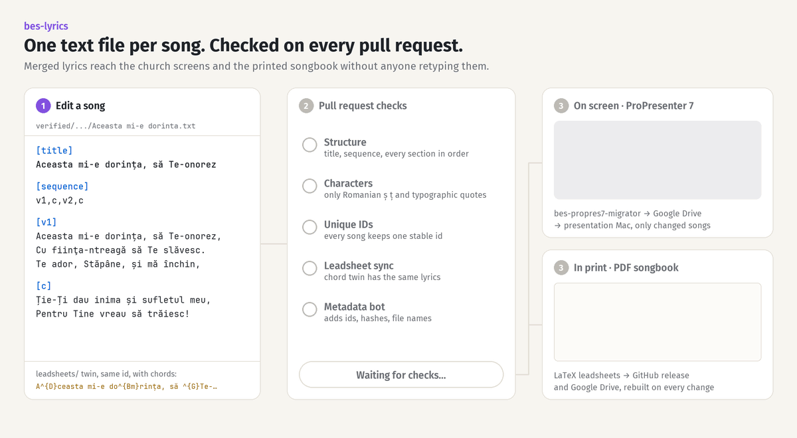

# bes-lyrics

[](https://github.com/ioanlucut/bes-lyrics/actions/workflows/ci.yml)
[](https://github.com/ioanlucut/bes-lyrics/releases/latest)
[](LICENSE)


**The song library of Biserica Emanuel Sibiu (BES), kept as plain text and
shipped automatically to the church screens and to a printed songbook with
chords.**

Every song is one `.txt` file. A pull request runs checks that reject broken
structure, wrong Romanian diacritics and chord sheets that drift from the
lyrics. Once merged, GitHub Actions turns the same files into ProPresenter 7
presentations and rebuilds the PDF songbook.



## What this solves

A church that projects lyrics every Sunday and prints chord sheets for its bands
ends up with many copies of each song. Kept by hand, those copies drift apart. A
typo fixed on screen survives in print, `ş` and `ș` look alike but are different
characters, the same song gets imported twice under two names, and nobody knows
which copy is current.

`bes-lyrics` makes a single text file the source of truth for each song:

- **Lyrics are reviewed like code.** Every change arrives as a pull request with
  a diff, a reviewer and a history.
- **A bad song cannot reach the screen.** The checks run on every pull request
  and block the merge when a song is malformed.
- **Nobody retypes anything.** ProPresenter presentations and the PDF songbook
  are generated from the merged files.

## In production

Since March 2023 this repository has held the whole song library of BES: 1,935
songs for the worship bands, the mixed, men's and children's choirs, Sunday
school groups and the brass band. 347 of them also have a chorded lead sheet,
and the 291 worship-band lead sheets make up the printed songbook.

| Output                          | Built from                             | Delivered to                                                                                                                                                   |
| ------------------------------- | -------------------------------------- | -------------------------------------------------------------------------------------------------------------------------------------------------------------- |
| ProPresenter 7 presentations    | `verified/`                            | Google Drive, then the presentation Mac, through [`bes-propres7-migrator`](https://github.com/ioanlucut/bes-propres7-migrator); only new or changed songs ship |
| PDF songbook with chords        | `leadsheets/trupe_lauda_si_inchinare/` | [GitHub Releases](https://github.com/ioanlucut/bes-lyrics/releases) and Google Drive, rebuilt on every change                                                  |
| Projection team code of conduct | `LaTeX/conduct/`                       | GitHub Releases and Google Drive                                                                                                                               |

## Highlights

- **A format anyone can edit.** A song is a title line, a sequence such as
  `v1,c,v2,c`, and one block per section. No app, no database, no export step.
  See [Song format](docs/song-format.md).

- **Checks that block, not just warn.** Every pull request runs lint and tests,
  then verifies file types, song structure, allowed characters, unique song IDs
  and lead-sheet consistency across the whole library. See
  [Architecture](docs/architecture.md#the-checks).

- **A bot does the bookkeeping.** After the checks pass, a GitHub Actions bot
  assigns missing IDs, computes content hashes, renames files after their
  metadata, normalizes typography (`ş` → `ș`, `"` → `”`, `nici o` → `nicio`) and
  commits the result back to the pull request.

- **Lyrics and chords cannot drift.** A chorded lead sheet in `leadsheets/`
  shares its song's `id`. CI strips the chords and requires the lyrics, sequence
  and metadata to match the chord-free song exactly.

- **Songs are formatted like code.** A custom Prettier plugin parses and
  reprints every song, so metadata order, section spacing and sequences are
  always canonical.

- **Importing is a one-line change.** Add a
  [Resurse Creștine](https://www.resursecrestine.ro) song ID or author to a
  list, open a pull request, and a bot imports the songs into `candidates/` for
  review.

## Quick start

Requires Node.js 24 (see [`.nvmrc`](.nvmrc)).

```bash
git clone https://github.com/ioanlucut/bes-lyrics.git
cd bes-lyrics
npm ci
npm run build:ci   # lint, tests and every blocking song check
```

To add or fix a song, edit its file under `verified/` and open a pull request.
[Contributing](docs/contributing.md) walks through it, including lead sheets and
imports.

To build the songbook locally you also need TeX Live with XeLaTeX:

```bash
npm run songbook:dist   # writes LaTeX/songbook/bes-songbook.pdf
```

## Repository layout

| Path                          | Contents                                                                          |
| ----------------------------- | --------------------------------------------------------------------------------- |
| `verified/`                   | Canonical, chord-free songs, grouped by ensemble; this is what ProPresenter shows |
| `leadsheets/`                 | Chorded twins of verified songs, used for the PDF songbook                        |
| `candidates/`                 | Imported or proposed songs waiting for review; not checked by CI                  |
| `src/`                        | Parser, printer, validators, reprocessors and the lead-sheet converter            |
| `bin/`                        | Command-line validators and reprocessors behind the `npm run` scripts             |
| `LaTeX/`                      | Songbook template and converter, and the code of conduct document                 |
| `import-songs-temp-runners/`  | Resurse Creștine import lists and scripts                                         |
| `skills/bes-song-leadsheets/` | Instructions for AI agents that author songs and lead sheets                      |

## Documentation

- [Song format](docs/song-format.md): the file format, metadata, section markers
  and allowed characters.
- [Lead sheets and songbook](docs/leadsheets-and-songbook.md): chord markup and
  how the PDF is built.
- [Architecture](docs/architecture.md): the pipeline, every check, the metadata
  bot and the workflows.
- [Contributing](docs/contributing.md): adding, editing and importing songs.

## Related repositories

- [`bes-propres7-migrator`](https://github.com/ioanlucut/bes-propres7-migrator)
  converts `verified/` into ProPresenter 7 `.pro` files and deploys them.
- [`bes-lyrics-parser`](https://github.com/ioanlucut/bes-lyrics-parser)
  (private) scrapes Resurse Creștine and provides the songs the importer reads.

## License

[GNU GPL v3](LICENSE).
