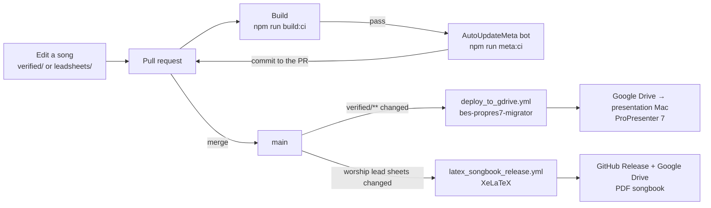

# Architecture

`bes-lyrics` is a Git repository of song files plus the TypeScript tooling that
keeps them consistent. GitHub Actions does the rest: it checks every pull
request, writes metadata back to it, and after a merge ships the songs to
ProPresenter and to the PDF songbook.

## Songs as data

`src/songParser.ts` parses a song file into a `SongAST`: title, metadata,
sequence and a map of sections. `src/songPrinter.ts` prints a `SongAST` back to
text in canonical form. Everything else is built on this round trip:

- the [Prettier plugin](../src/prettier-bes-txt-plugin/index.ts) formats `.txt`
  files by parsing and reprinting them;
- the reprocessors parse, transform and reprint;
- the validators parse and assert;
- the lead-sheet converter turns a parsed song into LaTeX.

Parsing and printing also fill in what is derivable. Parsing generates a missing
`id` with `short-uuid`. Printing recomputes `contentHash` from the printed song
without its title metadata, so the hash is the same whether or not the input was
formatted, and a chorded lead sheet and its chord-free song have different
hashes.

## The checks

`npm run build:ci` runs on every pull request, and a failure blocks the merge.

| Step                     | Script                     | Rejects                                                                                                                                                                                                                                                                                                         |
| ------------------------ | -------------------------- | --------------------------------------------------------------------------------------------------------------------------------------------------------------------------------------------------------------------------------------------------------------------------------------------------------------- |
| Lint                     | `lint`                     | ESLint warnings or errors in the TypeScript tooling                                                                                                                                                                                                                                                             |
| Types                    | `typecheck`                | TypeScript errors anywhere in the tooling, which the scripts' runner, `tsx`, would otherwise skip because it only transpiles                                                                                                                                                                                    |
| Formatting               | `lint:format`              | `README.md`, `docs/` or TypeScript not formatted by Prettier, which `npm run format` fixes                                                                                                                                                                                                                      |
| Tests                    | `test:ci`                  | Parser, printer, validator and converter regressions; a song in the library that formats differently on a second pass, or a lead sheet whose TeX leaves an environment open; coverage of `src/` below its floor; docs whose links, example song, allowed characters or section markers no longer match the code |
| File types               | `verify:file-extensions`   | Anything other than `.txt` in `verified/`                                                                                                                                                                                                                                                                       |
| Unique IDs               | `verify:uniqueness-of-ids` | A song without an `id`, or two songs with the same one                                                                                                                                                                                                                                                          |
| Lead sheets              | `verify:leadsheets`        | Chords in `verified/`; invalid chords; a lead sheet without chords, with an unknown or duplicate `id`, or whose metadata, sequence, section order or chord-free lyrics differ from its song                                                                                                                     |
| Characters and structure | `verify`                   | Characters outside the [allowed set](song-format.md#allowed-characters) in a file name or song, and every [format](song-format.md) rule: missing title or sequence, unknown markers, sections missing from the sequence or vice versa, non-consecutive numbering                                                |

These checks cover `verified/` and `leadsheets/`. `candidates/` is not checked
on CI.

Some checks run only on demand, because they need judgement:

| Script               | Reports                                                                                                                                                                                                                                                                                                                                                                                                                                                             |
| -------------------- | ------------------------------------------------------------------------------------------------------------------------------------------------------------------------------------------------------------------------------------------------------------------------------------------------------------------------------------------------------------------------------------------------------------------------------------------------------------------- |
| `verify:similarity`  | Pairs of songs whose lyrics are more than 65% similar, comparing candidates with each other, candidates with verified songs, and verified songs with each other. `verify:similarity:mv` replaces the verified song with the candidate and `verify:similarity:rm` deletes the candidate; both compare only candidates with verified songs and never change a verified song on their own, and `:mv` leaves in place candidates that duplicate the same verified song. |
| `dictionary:analyze` | Words the Romanian dictionary (plus `custom-dictionary_ro.txt`) does not know. It is not reliable enough to block; `dictionary:update` adds the reported words to the custom dictionary.                                                                                                                                                                                                                                                                            |

## The metadata bot

When `Build` passes, the `AutoUpdateMeta` job runs `npm run meta:ci` on the pull
request branch and commits any changes as
`[Bot] I have added all of the meta information…`:

1. `reprocess:filename` renames each file after its metadata (see
   [Song format](song-format.md#title-and-metadata)). If a new name belongs to
   another song, or two songs would get the same name, it renames nothing and
   fails, naming the songs whose metadata must differ.
2. `reprocess:content` normalizes text and reprints each song, which assigns
   missing IDs: `ş`/`ţ` → `ș`/`ț`, `"` → `”`, `'` → `’`, `…` → `...`, double
   spaces, `nici o` → `nicio`, `Cristos` → `Hristos`, capitalized divine names
   (`Domnul`, `Isus`, `Mesia`, …), and Windows line endings.
3. `verify` checks characters and structure again.
4. `format` reprints every song and lead sheet through the Prettier plugin,
   refreshing content hashes.
5. `verify:leadsheets` confirms the lead sheets still match their songs.

If the bot commits anything, it runs the whole `npm run build:ci` on that commit
before pushing it, because a push made with the workflow token starts no new
workflow run. Pull the bot's commit before pushing more changes to the same
branch.

## Workflows

| Workflow                                                                        | Trigger                                                                                                                                                        | What it does                                                                                                                                                                                                                                        |
| ------------------------------------------------------------------------------- | -------------------------------------------------------------------------------------------------------------------------------------------------------------- | --------------------------------------------------------------------------------------------------------------------------------------------------------------------------------------------------------------------------------------------------- |
| [`ci.yml`](../.github/workflows/ci.yml)                                         | Pull request                                                                                                                                                   | `Build` on the pull request merged into `main`, then `AutoUpdateMeta` on its branch. `AutoUpdateMeta` skips pull requests from forks, which the workflow token cannot push to.                                                                      |
| [`deploy_to_gdrive.yml`](../.github/workflows/deploy_to_gdrive.yml)             | Push to `main` touching `verified/**`, or manual run                                                                                                           | Checks out [`bes-propres7-migrator`](https://github.com/ioanlucut/bes-propres7-migrator) and runs `convert:remote`, which builds `.pro` files and uploads new, changed or renamed songs to Google Drive. The manual run can force a full re-deploy. |
| [`latex_songbook_release.yml`](../.github/workflows/latex_songbook_release.yml) | Push to `main` touching the same paths as `songbook_build.yml`                                                                                                 | Builds the PDF with `songbook_build.yml`, publishes it as a `BES_Songbook_<date>` release and uploads it to Google Drive.                                                                                                                           |
| [`songbook_build.yml`](../.github/workflows/songbook_build.yml)                 | Pull request touching the worship lead sheets, `LaTeX/songbook/**`, the converter, parser or chord code, or the songbook workflows; also called by the release | Converts the lead sheets to LaTeX, compiles the PDF with XeLaTeX and keeps it as the `bes-songbook` artifact for 14 days, so a pull request shows whether the songbook still compiles before it merges.                                             |
| [`latex_conduct_release.yml`](../.github/workflows/latex_conduct_release.yml)   | Push to `main` touching `LaTeX/conduct/**`                                                                                                                     | Compiles the projection team's code of conduct and publishes it the same way.                                                                                                                                                                       |
| [`claude.yml`](../.github/workflows/claude.yml)                                 | A comment mentioning `@claude`                                                                                                                                 | Runs a Claude review or task on the issue or pull request.                                                                                                                                                                                          |

Every workflow declares the permissions it needs, and the repository's default
workflow token is read-only. Actions are pinned to commit SHAs.
[Dependabot](../.github/dependabot.yml) proposes npm and Actions updates once a
month, minor and patch versions grouped into one pull request, and keeps `chalk`
and `p-map` on their current majors as `.ncurc.json` does.

## Related repositories

- [`bes-propres7-migrator`](https://github.com/ioanlucut/bes-propres7-migrator)
  owns everything after `verified/`: the ProPresenter format, incremental
  deploys and the presentation Mac sync.
- [`bes-lyrics-parser`](https://github.com/ioanlucut/bes-lyrics-parser)
  (private) scrapes Resurse Creștine into `out/resurse_crestine/`, which the
  import scripts read from a sibling checkout (`../bes-lyrics-parser`).
